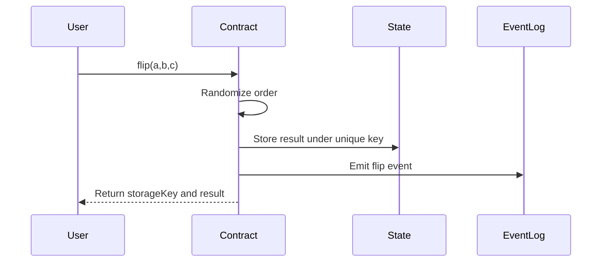

# Magi Contract Tutorial

You asked for a Magi contract tutorial from start to finish? I got you!

This tutorial walks through building a smart contract for the Magi network. We'll create a simple "flip" contract that randomly shuffles a list of possible values - useful for things like random selection, lottery draws, or simple day-to-day decisions :D Should I do the dishes? Ask you contract!

Before we jump right in I want to mention that the Magi chain is constantly in development and the tutorial could become outdated pretty soon. Make sure to check the official [contract-template repo](https://github.com/vsc-eco/go-contract-template) and the announcements of the Magi network for all the fresh SDK functions, news and possibilities. Also it is planned that there will be an SDK for other languages in near future so keep an eye out for that as well.

Big thanks to @techcoderx for his work and all the help he offered me while creating my first few contracts. Now let us jump in!

## Setup

- [Go](https://go.dev/dl/) 1.24+
- [TinyGo](https://tinygo.org/getting-started/install/) compiler (for WASM compilation)
- [wasm tools](https://github.com/bytecodealliance/wasm-tools) or [wabt](https://github.com/WebAssembly/wabt)
- Basic understanding of Go programming

## Project Structure

In the video I will cover the flip contract. You can clone it from: https://github.com/tibfox/magi_contract_tutorial_flip
I will cover most of below but I will not go in detail about the different SDK functions. That is a topic for another video.

After cloning the tutorial repo you will find this structure:

```
magi_contract_tutorial_flip/
├── contract/
│   ├── main.go          # Main contract logic and exported functions
│   └── random.go        # Randomization utilities
├── sdk/
│   ├── sdk.go           # Core SDK functions (state, logging, etc.)
│   ├── env.go           # Environment/context types
│   ├── address.go       # Address handling (Hive, EVM, etc.)
│   └── asset.go         # Asset types (HIVE, HBD)
├── test/
│   └── contract_test.go # Integration tests
├── artifacts/
│   └── main.wasm        # Compiled contract
└── go.mod
```

## Flow of the contract

Before we start to dive into the code I made this simple diagram to showcase the contract flow:



1. User executes the flip function providing a collection of possible results (a|b|c)
2. Contract randomizes the order using deterministic shuffling
3. Contract stores the result in state under a unique key based on transaction data
4. Contract emits the random order as an event log
5. Contract returns the storage key and shuffled result

---

## Part 1: Cloning template

The Magi network provides an up-to-date [contract template](https://github.com/vsc-eco/go-contract-template) you can clone for your starting point. In this tutorial I will not go into details about it here as I assume you clone my [tutorial repo instead](https://github.com/tibfox/magi_contract_tutorial_flip). 


## Part 2: Understanding the SDK

The SDK provides the interface between your contract and the Magi network. Make sure to always have the current sdk when developing a contract. Let's examine the key components of this folder.

### Environment Context

When your contract executes, it receives context about the transaction via `sdk.GetEnv()`:

```go
type Env struct {
    ContractId    string   // This contract's ID
    ContractOwner string   // Owner address

    TxId          string   // Transaction ID
    Index         uint64   // Transaction index in block
    OpIndex       uint64   // Operation index in transaction

    BlockId       string   // Current block ID
    BlockHeight   uint64   // Current block height
    Timestamp     string   // Block timestamp

    Sender        Sender   // Who initiated this call
    Caller        Address  // Direct caller (could be another contract)
}
```

The `Sender` contains authentication details but usually `Sender.Address` is enough for verifying permissions in your contract.
The `Caller` is who actually called the contract function. That can be a user but also another contract. There can be a chain of up to 20 contracts but the original environment is always persistent so checking permissions can be made on the initial sender of the transaction.


```go
type Sender struct {
    Address              Address   // Sender's address
    RequiredAuths        []Address // Active authority signers
    RequiredPostingAuths []Address // Posting authority signers
}
```

### Address Types

The network supports multiple address formats:

| Type | Prefix | Example |
|------|--------|---------|
| Hive | `hive:` | `hive:username` |
| EVM | `did:pkh:eip155` | `did:pkh:eip155:1:0x...` |
| Contract | `contract:` | `contract:abc123` |
| System | `system:` | `system:rewards` |

For now I personally only made contracts that work with hive addresses and I assume that this list will increase with time.

### Core SDK Functions

**State Management:**
```go
sdk.StateSetObject(key, value string)    // Store a value
sdk.StateGetObject(key string) *string   // Retrieve a value
sdk.StateDeleteObject(key string)        // Remove a value
```

It is important to mention here that `sdk.StateSetObject()` is the most expensive single-call of the current system. Be mindful of that and try to allocate contract state as early as possible if you know how the state value will look like. Updates will become cheaper this way. Also try to minimize state value length by implementing mappings of known values (states, types and this kind of stuff) so you only store integers instead of whole strings. There are many ways to improve state usage but this depends highly on your use-case. Keep an eye out for my upcoming videos/posts about that topic.

**Logging:**
```go
sdk.Log(message string)  // Emit an log
```

This method can be used for simple logs but is also used to emit event logs for external indexers. More on that later.

**Transaction Control:**
```go
sdk.Abort(msg string)           // Hard abort
```
This will revert the whole contract call, revert fund movements and state interactions. It is smart to abort as early as possible to minimize ressources when the call fails and add a reason for the abort in the `msg` of course.

**Asset Operations:**
```go
sdk.GetBalance(address Address, asset Asset) int64 // read the balance of a Magi address
sdk.HiveDraw(amount int64, asset Asset)           // Pull funds from the **caller**
sdk.HiveTransfer(to Address, amount int64, asset Asset)  // Sends funds from the contract
sdk.HiveWithdraw(to Address, amount int64, asset Asset)  // Unmap to Hive account 
```
`sdk.GetBalance()`, `sdk.HiveDraw()` and `sdk.HiveTransfer()` are all operating on Magi itself while `sdk.HiveWithdraw()` will send funds from the contract to the receiver on the Hive blockchain.

**Cross-Contract Calls:**
```go
sdk.ContractStateGet(contractId, key string) *string
sdk.ContractCall(contractId, method, payload string, options *ContractCallOptions) *string
```

These are super powerful tools where you can chain execute up to 20 contracts. For example you could create a task market platform/contract that calls my [escrow contract](https://ecency.com/hive-139531/@tibfox/kinoko-escrow-trust-made-simple) in order to create a secure trustless payment acknoledgement between two parties. No need to implement your own logic here. Also the contract we cover here can be used to find a random value out of multiple ones. You could just call this contract and save space/time for your own logic.

---

## Part 3: Writing the Contract

### The Main Entry Point

Every contract needs an empty `main()` function for WASM export to work:

```go
package main

func main() {
    // Required for wasm export - leave empty
}
```

For super small contracts it is enough if you only have one main.go file but I try to split my contract in a reasonable structure of multiple files. It is up to you but at least 1the `main.go` with the `main()` needs to exist for your contract.

### Exporting Functions

Use the `//go:wasmexport` directive to expose functions to the network:

```go
//go:wasmexport flip
func Flip(payload *string) *string {
    // Contract logic here
}
```

These functions are the ones the users of your contract will interact with. They receive and return only one string pointer each. No int or multiple arguments - just one string in and one string out.

For payloads, I find that csv (simple delimited strings) is the more gas efficient compared to the commonly known JSON format. JSON needs some overhead in characters, but also a lot of parsing logic in the WASM itself. I did not try the `sdk_tinyjson.go` implementation though.

### Implementing the Flip Function

Let's break down the flip contract step by step:

**Step 1: Validate Input**

```go
//go:wasmexport flip
func Flip(payload *string) *string {
    if payload == nil || *payload == "" {
        sdk.Abort("payload is required")
        return nil
    }

    possibilities := strings.Split(*payload, "|")
    if len(possibilities) < 2 {
        sdk.Abort("at least 2 possibilities are required")
        return nil
    }
```

Always validate inputs early and use `sdk.Abort()` with a descriptive message.

**Step 2: Get Execution Context**

```go
    env := sdk.GetEnv()
    sender := env.Sender.Address.String()
```

As described aboe the `sdk.GetEnv()` will give you all values of the current execution environment. If you only need one value it is better gas wise if you use `sdk.getEnvKey()`.


**Step 3: Generate Deterministic Randomness**

```go
    seed := generateSeed(env.BlockHeight, env.Index, env.OpIndex)
    shuffled := shuffleWithSeed(possibilities, seed)
```

The seed combines block height, transaction index, and operation index. This ensures:
- Same input in same transaction position = same output (deterministic)
- Different call = different output (unique per call)

These operations need to be determistic so every witness will receive the exact same result. This is important - otherwise the call will fail.

**Step 4: Store the Result**

```go
    result := strings.Join(shuffled, "|")
    storageKey := strconv.FormatUint(env.BlockHeight, 10) +
        "-" + strconv.FormatUint(env.Index, 10) +
        "-" + strconv.FormatUint(env.OpIndex, 10)

    sdk.StateSetObject(storageKey, result)
```

In the current use-case a state write is not needed (and will cost gas without a reason) but I kept it in the code so you will have an example.


**Step 5: Emit Event Log**

```go
    logMessage := "flip;sender:" + sender + ";result:" + result
    sdk.Log(logMessage)
```

Logs are useful for off-chain indexers and debugging. There is no official magi indexer available yet but if you follow the same structure I can add your contract to my personal build and help you provide user friendly data for your own UI.

This is especially useful if you want to query values just like: 
- all flips of hive:tibfox
- all flips that had only two results
- all flips from the past 2 weeks
- etc.

This structure works the best with my build: 
prefix;key1:value1;key2:value2;...

The `;` is up to you and also if you want to add keys or not. Just get in contact with me and I can tell what is possible.

**Step 6: Return Result**

```go
    returnValue := storageKey + " -> " + result
    return &returnValue
}
```

Here we send a result back to the sender - as described above we do this via string pointer.

### The Randomization Logic

The `random.go` file contains the shuffling implementation using the Fisher-Yates shuffle. I just copied it from somewhere and ported it to go. It is super simple and determistic.

```go
func generateSeed(blockHeight uint64, index uint64, opIndex uint64) uint64 {
    // Prime multipliers reduce collision likelihood
    return blockHeight*1000003 + index*1009 + opIndex
}

func shuffleWithSeed(items []string, seed uint64) []string {
    n := len(items)
    result := make([]string, n)
    copy(result, items)

    // Linear Congruential Generator (LCG)
    a := uint64(1664525)
    c := uint64(1013904223)
    m := uint64(1 << 32)
    state := seed

    // Fisher-Yates shuffle
    for i := n - 1; i > 0; i-- {
        state = (a*state + c) % m
        j := int(state % uint64(i+1))
        result[i], result[j] = result[j], result[i]
    }

    return result
}
```

There are other ways to find a determistic "random" result but that is the most simple in my opinion.

---

## Part 4: Testing

### Compiling the Contract for Testing

Contracts are compiled to WebAssembly using TinyGo:

`tinygo build -gc=custom -scheduler=none -panic=trap -no-debug -target=wasm-unknown -o test/artifacts/main.wasm ./contract`

This will place the compiled main.wasm file in the `test/artifacts` folder. 

### Running Tests

Tests use the `go-vsc-node` [test utilities](https://github.com/vsc-eco/go-vsc-node/tree/main/lib/test_utils) which provide a mock environment:

```go
package test

import (
    "encoding/json"
    "os"
    "testing"

    "vsc-node/lib/test_utils"
    "vsc-node/modules/db/vsc/contracts"
    ledgerDb "vsc-node/modules/db/vsc/ledger"
    stateEngine "vsc-node/modules/state-processing"

    "github.com/stretchr/testify/assert"
)

func TestFlip(t *testing.T) {
    // Load compiled contract
    testCode, err := os.ReadFile("../artifacts/main.wasm")
    assert.NoError(t, err)

    // Create test environment
    ct := test_utils.NewContractTest()
    ct.Deposit("hive:flipuser", 5000, ledgerDb.AssetHive)
    ct.RegisterContract("vsc_flip_contract", "hive:flipowner", testCode)

    // Define transaction context
    txSelf := stateEngine.TxSelf{
        TxId:                 "2testtxid",
        BlockId:              "blockid122",
        Index:                0,
        OpIndex:              0,
        Timestamp:            "2025-09-03T12:00:00",
        RequiredAuths:        []string{"hive:flipuser"},
        RequiredPostingAuths: []string{},
    }

    // Call the contract
    callResult, _, logsMap := ct.Call(stateEngine.TxVscCallContract{
        Self:       txSelf,
        ContractId: "vsc_flip_contract",
        Action:     "flip",
        Payload:    json.RawMessage([]byte(`"tibfox|stevenson7|meno|ph1102"`)),
        RcLimit:    1000,
        Intents:    []contracts.Intent{},
    })

    // Verify results
    t.Logf("Return: %s", callResult.Ret)
    t.Logf("RC: %.3f", float64(callResult.RcUsed)/1000)
    t.Logf("Logs: %v", logsMap["vsc_flip_contract"])

    assert.True(t, callResult.Success, "flip call should succeed")
}
```

### Key Testing Concepts

**ContractTest**: Creates an isolated test environment with its own state.

**Deposit**: Funds test accounts. Required if your contract handles assets - here we do not need it.

**RegisterContract**: Deploys your WASM code with a contract ID and owner.

**TxSelf**: Simulates transaction metadata (block height, indices, signers).

**Call**: Executes a contract function and returns:
- `callResult`: Success status, return value, RC (resource credits) used
- `logsMap`: Event logs emitted by the contract

In the end we assert the test to be successful.

### Running Tests

```bash
go test ./test -v
```

Example output:
```
=== RUN   TestFlip
    contract_test.go:43: Return: 0-0-0 -> meno|ph1102|tibfox|stevenson7
    contract_test.go:44: RC: 0.847
    contract_test.go:45: Logs: [flip;sender:hive:flipuser;result:meno|ph1102|tibfox|stevenson7]
--- PASS: TestFlip (0.12s)
```

For bigger test files and continous testing it is better to run `go test ./test` as this only gives you "ok" or failure details back.

---


## Part 5: Compiling the Contract for Deployment

The command is similar to the test build but we are going to use a **specific tinygo docker image** for reproducible builds and source code verification:

```bash
docker pull tinygo/tinygo:0.39.0
docker run --rm -v $(pwd):/home/tinygo tinygo/tinygo:0.39.0 \
  tinygo build -gc=custom -scheduler=none -panic=trap -no-debug \
  -target=wasm-unknown -o artifacts/main.wasm ./contract
```

Key flags:
- `-gc=custom`: Uses custom garbage collection for WASM
- `-scheduler=none`: Disables the Go scheduler (not needed in contracts)
- `-panic=trap`: Converts panics to WebAssembly traps
- `-target=wasm-unknown`: Compiles to generic WebAssembly
- `-no-debug`: Reduces binary size by stripping debug info

The compiled `.wasm` file goes in the `artifacts/` directory.

### Optimizing Binary Size

Next we strip metadata to reduce file size even more before deployment (also mandatory for contract verification):

```bash
# Using Wabt
wasm-strip -o artifacts/main-stripped.wasm artifacts/main.wasm

# Or using Wasm Tools
wasm-tools strip -o artifacts/main-stripped.wasm artifacts/main.wasm
```

---

## Part 6: Deployment

Once tested, we can finally deploy our contract to the network. For this we have some requirements: 

### Prerequisites

- A Hive account with at least **10 HBD** (deployment fee per contract)
- Your Hive private active key
- `vsc-contract-deploy` needs to be built by you:
```
git clone https://github.com/vsc-eco/go-vsc-node
cd go-vsc-node
go mod download
go build -buildvcs=false -o vsc-contract-deploy vsc-node/cmd/contract-deployer
```

This will generate a program called `vsc-contract-deploy` in the root folder. For the upcoming commands I assume that you placed it in your PATH directory like /usr/bin on Linux for example.


There is a deployment fee of **10 HBD** per contract, paid from your **Hive account** balance. This fee is needed to secure the system and let people think twice before deploying unfinished contracts. I learned that the hard way ;) 


### Step 1: Initialize Configuration

```bash
vsc-contract-deploy -init
```

This creates `data/config/identityConfig.json`. Edit it with your Hive username and active key:

```json
{
  "username": "your-hive-username",
  "activeKey": "your-active-private-key"
}
```


### Step 2: Deploy the Contract

```bash
vsc-contract-deploy -wasmPath artifacts/main-stripped.wasm -name "Flip Contract"
```

The CLI will:
1. Upload your WASM binary to the network
2. Register the contract on-chain
3. Return your **contract ID** for future calls

For my previous contracts techcoderx took the name for a display name in[Magi Blocks](https://vsc.techcoderx.com/contracts)


---

## Part 7: Calling Your Deployed Contract

Once deployed, you can interact with your contract using the contract page on [Magi Blocks](https://vsc.techcoderx.com/contracts). Select your newly deployed contract and open the tab "Call Contract". Enter the following parameters:

|Field|Input|
|-|-|
|Method|`flip`|
|Payload|`a\|b\|c`|
|RC limit|`1000`|
|Key Type|`Active`|


Hit "Call Contract" and go back to "Transactions" - there you should see your sent transaction. Click on that, wait until it says "confirmed" and inspect the "Call Output" or the "Logs" to see the flipped results.

**This is the moment you can be proud! Tell your freinds & family about your big success ;)**


---

## Part 8: Verifying Your Contract

To allow others to inspect your contract's source code, verify it on the [Magi Blocks](https://vsc.techcoderx.com).

For this our code needs to be published as public github repository. Also the source code needs to be 100% the same as your deployed version. The contract verifier will download and build your contract. Then it will use the wasm tools you have selected to strip the wasm file too. It is **important** that you select the correct versions and tools for the verifier to succeed.

Go on "Tools" -> "Verify Contract" -> read the explainer and hit "Next".

Enter all the details in there and hit "submit". The contract should get verified if you met all the requirements. 
If not @techcoderx can help you as he did help me multiple times. 

---

## We made it!

Now you have all infos you need in order to build your own smart contracts on the Magi network! There is still plenty to learn for you from the Go language in general, optimization of gas consumption and much much more. It is a fun journey and I am excited about wht you are going to build! If you want your contracts to get featured on okinoko.io - please contact me!

Also keep an eye out for upcoming videos about the Magi network!
I am planning to make a deep dive into every single SDK function - let me know if you want to see that or if you have any other topic suggestions.