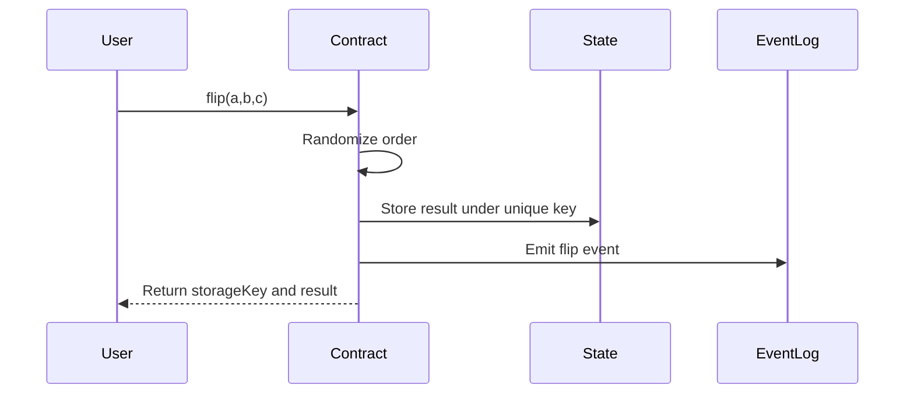

# Magi Contract Tutorial

You asked for a Magi contract tutorial from start to finish? I got you!

This tutorial walks through building a smart contract for the Magi network. We'll create a simple "flip" contract that randomly shuffles a list of possibilities - useful for things like random selection, lottery draws, or turn order randomization.

Remember that the Magi chain is constantly in development and this tutorial could become outdated pretty soon. Make sure to check the official [contract-template repo](https://github.com/vsc-eco/go-contract-template) and the announcements of the Magi network. Also it is planned that there wwill be an sdk for other languages in near future so keep an eye out for that as well.


Big thanks to @techcoderx for his work and all the help he offered me while creating my first few contracts. Now let us jump in!

## Setup

- [Go](https://go.dev/dl/) 1.24+
- [TinyGo](https://tinygo.org/getting-started/install/) compiler (for WASM compilation)
- [wasm tools](https://github.com/bytecodealliance/wasm-tools) or [wabt](https://github.com/WebAssembly/wabt)
- Basic understanding of Go programming

## Project Structure

```
magi_contract_tutorial_flip/
├── contract/
│   ├── main.go          # Main contract logic and exported functions
│   └── random.go        # Randomization utilities
├── sdk/
│   ├── sdk.go           # Core SDK functions (state, logging, etc.)
│   ├── env.go           # Environment/context types
│   ├── address.go       # Address handling (Hive, EVM, etc.)
│   └── asset.go         # Asset types (HIVE, HBD)
├── test/
│   └── contract_test.go # Integration tests
├── artifacts/
│   └── main.wasm        # Compiled contract
└── go.mod
```

## Flow of the contract



1. User executes the flip function providing a collection of possible results (a|b|c)
2. Contract randomizes the order using deterministic shuffling
3. Contract stores the result in state under a unique key based on transaction data
4. Contract emits the random order as an event log
5. Contract returns the storage key and shuffled result

---

## Part 1: Cloning template

The Magi network provides an up-to-date [contract template](https://github.com/vsc-eco/go-contract-template) you can clone for your starting point. In this tutorial I will not go into details about it here as I assume you clone my [tutorial repo instead](). 


## Part 1: Understanding the SDK

The SDK provides the interface between your contract and the Magi network. Let's examine the key components.

### Environment Context

When your contract executes, it receives context about the transaction via `sdk.GetEnv()`:

```go
type Env struct {
    ContractId    string   // This contract's ID
    ContractOwner string   // Owner address

    TxId          string   // Transaction ID
    Index         uint64   // Transaction index in block
    OpIndex       uint64   // Operation index in transaction

    BlockId       string   // Current block ID
    BlockHeight   uint64   // Current block height
    Timestamp     string   // Block timestamp

    Sender        Sender   // Who initiated this call
    Caller        Address  // Direct caller (could be another contract)
}
```

The `Sender` contains authentication details:

```go
type Sender struct {
    Address              Address   // Sender's address
    RequiredAuths        []Address // Active authority signers
    RequiredPostingAuths []Address // Posting authority signers
}
```

### Address Types

The network supports multiple address formats:

| Type | Prefix | Example |
|------|--------|---------|
| Hive | `hive:` | `hive:username` |
| EVM | `did:pkh:eip155` | `did:pkh:eip155:1:0x...` |
| Contract | `contract:` | `contract:abc123` |
| System | `system:` | `system:rewards` |

### Core SDK Functions

**State Management:**
```go
sdk.StateSetObject(key, value string)    // Store a value
sdk.StateGetObject(key string) *string   // Retrieve a value
sdk.StateDeleteObject(key string)        // Remove a value
```

**Logging:**
```go
sdk.Log(message string)  // Emit an event log
```

**Transaction Control:**
```go
sdk.Abort(msg string)           // Hard abort
```

**Asset Operations:**
```go
sdk.GetBalance(address Address, asset Asset) int64
sdk.HiveDraw(amount int64, asset Asset)           // Pull from caller
sdk.HiveTransfer(to Address, amount int64, asset Asset)  // Send from contract
sdk.HiveWithdraw(to Address, amount int64, asset Asset)  // Unmap to Hive account
```

**Cross-Contract Calls:**
```go
sdk.ContractStateGet(contractId, key string) *string
sdk.ContractCall(contractId, method, payload string, options *ContractCallOptions) *string
```

---

## Part 2: Writing the Contract

### The Main Entry Point

Every contract needs an empty `main()` function for WASM export to work:

```go
package main

func main() {
    // Required for wasm export - leave empty
}
```

### Exporting Functions

Use the `//go:wasmexport` directive to expose functions to the network:

```go
//go:wasmexport flip
func Flip(payload *string) *string {
    // Contract logic here
}
```

Functions receive and return string pointers. The payload contains whatever the caller passed in.

### Implementing the Flip Function

Let's break down the flip contract step by step:

**Step 1: Validate Input**

```go
func Flip(payload *string) *string {
    if payload == nil || *payload == "" {
        sdk.Abort("payload is required")
        return nil
    }

    possibilities := strings.Split(*payload, "|")
    if len(possibilities) < 2 {
        sdk.Abort("at least 2 possibilities are required")
        return nil
    }
```

Always validate inputs early. Use `sdk.Abort()` with a descriptive message.

**Step 2: Get Execution Context**

```go
    env := sdk.GetEnv()
    sender := env.Sender.Address.String()
```

**Step 3: Generate Deterministic Randomness**

```go
    seed := generateSeed(env.BlockHeight, env.Index, env.OpIndex)
    shuffled := shuffleWithSeed(possibilities, seed)
```

The seed combines block height, transaction index, and operation index. This ensures:
- Same input in same transaction position = same output (deterministic)
- Different transactions = different output (unique per call)

**Step 4: Store the Result**

```go
    result := strings.Join(shuffled, "|")
    storageKey := strconv.FormatUint(env.BlockHeight, 10) +
        "-" + strconv.FormatUint(env.Index, 10) +
        "-" + strconv.FormatUint(env.OpIndex, 10)

    sdk.StateSetObject(storageKey, result)
```

**Step 5: Emit Event Log**

```go
    logMessage := "flip;sender:" + sender + ";result:" + result
    sdk.Log(logMessage)
```

Logs are useful for off-chain indexers and debugging. There is no official indexer available yet but if you follow the same structire I can add your contract to my personal build and help you provide user friendly data for your own UI.

**Step 6: Return Result**

```go
    returnValue := storageKey + " -> " + result
    return &returnValue
}
```

### The Randomization Logic

The `random.go` file contains the shuffling implementation:

```go
func generateSeed(blockHeight uint64, index uint64, opIndex uint64) uint64 {
    // Prime multipliers reduce collision likelihood
    return blockHeight*1000003 + index*1009 + opIndex
}

func shuffleWithSeed(items []string, seed uint64) []string {
    n := len(items)
    result := make([]string, n)
    copy(result, items)

    // Linear Congruential Generator (LCG)
    a := uint64(1664525)
    c := uint64(1013904223)
    m := uint64(1 << 32)
    state := seed

    // Fisher-Yates shuffle
    for i := n - 1; i > 0; i-- {
        state = (a*state + c) % m
        j := int(state % uint64(i+1))
        result[i], result[j] = result[j], result[i]
    }

    return result
}
```

This uses:
- **LCG (Linear Congruential Generator)**: A simple PRNG with parameters from Numerical Recipes
- **Fisher-Yates shuffle**: Produces an unbiased permutation

---

## Part 3: Testing

### Compiling the Contract for Testing

Contracts are compiled to WebAssembly using TinyGo:

`tinygo build -gc=custom -scheduler=none -panic=trap -no-debug -target=wasm-unknown -o test/artifacts/main.wasm ./contract`

This will place the compiled main.wasm file in the `test/artifacts` folder. 

### Running Tests

Tests use the `vsc-node` test utilities which provide a mock environment:

```go
package test

import (
    "encoding/json"
    "os"
    "testing"

    "vsc-node/lib/test_utils"
    "vsc-node/modules/db/vsc/contracts"
    ledgerDb "vsc-node/modules/db/vsc/ledger"
    stateEngine "vsc-node/modules/state-processing"

    "github.com/stretchr/testify/assert"
)

func TestFlip(t *testing.T) {
    // Load compiled contract
    testCode, err := os.ReadFile("../artifacts/main.wasm")
    assert.NoError(t, err)

    // Create test environment
    ct := test_utils.NewContractTest()
    ct.Deposit("hive:flipuser", 5000, ledgerDb.AssetHive)
    ct.RegisterContract("vsc_flip_contract", "hive:flipowner", testCode)

    // Define transaction context
    txSelf := stateEngine.TxSelf{
        TxId:                 "2testtxid",
        BlockId:              "blockid122",
        Index:                0,
        OpIndex:              0,
        Timestamp:            "2025-09-03T12:00:00",
        RequiredAuths:        []string{"hive:flipuser"},
        RequiredPostingAuths: []string{},
    }

    // Call the contract
    callResult, _, logsMap := ct.Call(stateEngine.TxVscCallContract{
        Self:       txSelf,
        ContractId: "vsc_flip_contract",
        Action:     "flip",
        Payload:    json.RawMessage([]byte(`"tibfox|stevenson7|meno|ph1102"`)),
        RcLimit:    1000,
        Intents:    []contracts.Intent{},
    })

    // Verify results
    t.Logf("Return: %s", callResult.Ret)
    t.Logf("RC: %.3f", float64(callResult.RcUsed)/1000)
    t.Logf("Logs: %v", logsMap["vsc_flip_contract"])

    assert.True(t, callResult.Success, "flip call should succeed")
}
```

### Key Testing Concepts

**ContractTest**: Creates an isolated test environment with its own state.

**Deposit**: Funds test accounts. Required if your contract handles assets.

**RegisterContract**: Deploys your WASM code with a contract ID and owner.

**TxSelf**: Simulates transaction metadata (block height, indices, signers).

**Call**: Executes a contract function and returns:
- `callResult`: Success status, return value, RC (resource credits) used
- `logsMap`: Event logs emitted by the contract

### Running Tests

```bash
go test ./test -v
```

Example output:
```
=== RUN   TestFlip
    contract_test.go:43: Return: 0-0-0 -> meno|ph1102|tibfox|stevenson7
    contract_test.go:44: RC: 0.847
    contract_test.go:45: Logs: [flip;sender:hive:flipuser;result:meno|ph1102|tibfox|stevenson7]
--- PASS: TestFlip (0.12s)
```

---


## Part 4: Compiling the Contract for Deployment

The command is similar to the test build:

```bash
tinygo build -gc=custom -scheduler=none -panic=trap -no-debug -target=wasm-unknown -o artifacts/main.wasm ./contract
```

Key flags:
- `-gc=custom`: Uses custom garbage collection for WASM
- `-scheduler=none`: Disables the Go scheduler (not needed in contracts)
- `-panic=trap`: Converts panics to WebAssembly traps
- `-target=wasm-unknown`: Compiles to generic WebAssembly
- `-no-debug`: Reduces binary size by stripping debug info

The compiled `.wasm` file goes in the `artifacts/` directory.

### Using Docker (Recommended)

For reproducible builds and source code verification on block explorers:

```bash
docker pull tinygo/tinygo:0.39.0
docker run --rm -v $(pwd):/home/tinygo tinygo/tinygo:0.39.0 \
  tinygo build -gc=custom -scheduler=none -panic=trap -no-debug \
  -target=wasm-unknown -o artifacts/main.wasm ./contract
```

### Optimizing Binary Size

Strip metadata to reduce file size before deployment:

```bash
# Using Wabt
wasm-strip -o artifacts/main-stripped.wasm artifacts/main.wasm

# Or using Wasm Tools
wasm-tools strip -o artifacts/main-stripped.wasm artifacts/main.wasm
```

---

## Part 5: Deployment

Once tested, deploy your contract to the network using the `vsc-contract-deploy` CLI tool.

### Prerequisites

- A Hive account with at least **10 HBD** (deployment fee per contract)
- Your Hive active key

### Step 1: Initialize Configuration

```bash
vsc-contract-deploy -init
```

This creates `data/config/identityConfig.json`. Edit it with your credentials:

```json
{
  "username": "your-hive-username",
  "activeKey": "your-active-private-key"
}
```

### Step 2: Deploy the Contract

```bash
vsc-contract-deploy -wasmPath artifacts/main-stripped.wasm -name "Flip Contract"
```

The CLI will:
1. Upload your WASM binary to the network
2. Register the contract on-chain
3. Return your **contract ID** for future calls

### Deployment Cost

There is a deployment fee of **10 HBD** per contract, paid from your Hive account balance.

---

## Part 6: Calling Your Deployed Contract

Once deployed, you can interact with your contract using the [Magi Block Explorer](https://vsc.techcoderx.com).
Go on "Blockchain" -> "Contracts" -> select your contract -> Tab "Call Contract"

|Field|Input|
|-|-|
|Method|`flip`|
|Payload|`a\|b\|c`|
|RC limit|`1000`|
|Key Type|`Active`|


Hit "Call Contract" and go back to "Transactions" - there you should see your sent transaction. Click on that, wait until it says "confirmed" and inspect the "Call Output".

**This is the moment you can be proud and tell your freidnds about your success ;)**


---

## Part 7: Verifying Your Contract

To allow others to inspect your contract's source code, verify it on the [Magi Block Explorer](https://vsc.techcoderx.com).

For this our code needs to be published as public github repository. Also the source code needs to be the same as your deployed version.

Go on "Tools" -> "Verify Contract" -> read the explainer and hit "Next".
Enter all the details in there and hit "submit". The contract should get verified if you met all the requirements. If not @techcoderx can help you. 


---

## Summary

Building Magi contracts involves:

1. **SDK Integration**: Use the provided SDK for state, logging, and asset operations
2. **Function Export**: Mark public functions with `//go:wasmexport`
3. **Input Validation**: Always validate payloads and use `sdk.Abort()` for errors
4. **State Management**: Store persistent data with `StateSetObject`
5. **Event Logging**: Emit logs for off-chain tracking with `sdk.Log()`
6. **Testing**: Use the test utilities to verify behavior before deployment
7. **Compilation**: Build to WASM with TinyGo

The flip contract demonstrates these patterns in a simple, practical example. Use it as a starting point for more complex contracts!
